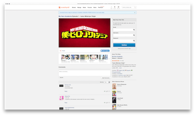

# Windowfy

This extension is designed to allow you to view videos at full window size if you want more video real estate but don't want to go full screen. Videos will scale to the size of the window regardless of resolution/aspect ratio.

## How-to

1. Play a video on one of the confirmed sites.
2. Right-click somewhere on the page and press Windowfy from the dropdown menu.
3. That's it! To get back to the original video size, press Esc.

 
## Works with

### Browsers:
- Firefox
- Chrome*

The extension has not yet been developed/tested for:
- Opera
- Safari
- Microsoft Edge
- Internet Explorer

### Confirmed Sites:
- Crunchyroll
- Masterani.me
- Funimation
- Streamable
- Vimeo**
- YouTube

_* Should also support Chromium based browsers/browsers that are compatible with the Chrome Web Store (such as Vivaldi, etc.)._  
_** Vimeo went premium during development, so needs further testing._

## Sideloading a Web Extension

### Firefox:
1. Open a new window, and in the URL bar, type: `about:debugging`.
2. Click the "Load Temporary Add-on" button.
3. Navigate to and open the extension's directory and select any file inside the extension.

If you make any changes to the extension's code, on the debugging page where you find the extension there should be a "Reload" button. Pressing that will reset the extension with all changes applied.

### Chrome:
1. Open a new window, and in the URL bar, type: `chrome://extensions`.
2. Toggle the "Developer Mode" switch in the upper right corner.
3. Click the "Load Unpacked" button in the upper right corner.
4. Navigate to and select the extension's directory.

If you make any changes to the extension's code, on the debugging page where you find the extension there should be a circular arrow that represents reload. Pressing that will reset the extension with all changes applied.

The extensions will be installed, and will stay installed until you restart the browser. 

## Known Issues

- If viewing a video that is Windowfied, and the aspect ratio of the browser window does not match the aspect ratio of the video, you may see the page content behind the video.
- [Crunchyroll] Occasional z-indexing issues where a popup from a video preview may show up above the video. Fix is to press Esc, hover over the offending video link until the popup goes away, and Windowfy again.
- [Vimeo] If you scroll the page while the video is playing, the video will revert to it's previous size. Fix is to press Esc, and Windowfy again.
- [Vimeo] If you exit from a Windowfied video then attempt to fullscreen the video, it will stay in its small size. Refresh the page to fix.
- [Vimeo] If you Windowfy, fullscreen, then exit the fullscreen video, the controls will be smaller than the video. Fix is to press Esc and Windowfy again.
- [YouTube] Timeline doesn't stretch to full width of video when not in theater mode.
- [YouTube] When not in theater mode, video timeline is limited to its smaller size, and video preview thumbnail is located in the middle of the video.  

## Goals

- Add more sites.
- Test on/migrate to other browsers.
- Possibly add popup/option page for site requests.
