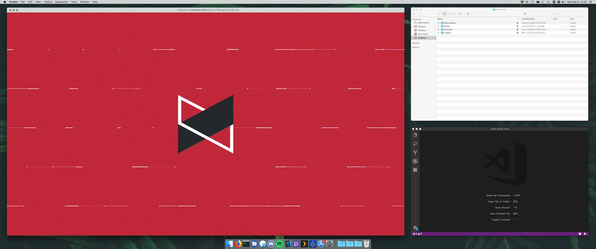
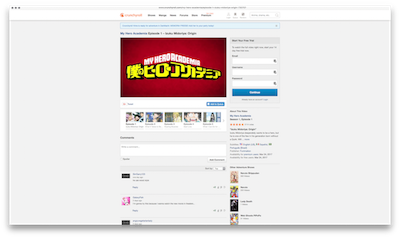
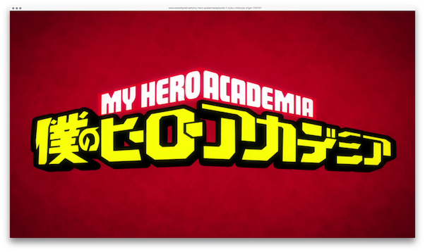

# Windowfy

This extension is designed to allow you to view videos at full window size if you want more video real estate but don't want to go full screen. Videos will scale to the size of the window regardless of resolution/aspect ratio.

## How-to

1. Play a video on one of the confirmed sites.
2. Right-click somewhere on the page and press Windowfy from the dropdown menu.
3. That's it! To get back to the original video size, press Esc.

 
## Works with

### Browsers:
- Firefox

### Sites:
- Crunchyroll
- Masterani.me
- Vimeo
- YouTube

## Known Issues

- Activating the extension while the video is already Windowfied will not allow you to return to the original video size without a page refresh.
- If viewing a video that is Windowfied, and the aspect ratio of the browser window does not match the aspect ratio of the video, you will see the page content behind the video.
- [Crunchyroll] Pressing Esc to return to original video size doesn't always work. Refresh the page to revert.
- [Crunchyroll] Occasional z-indexing issues where a popup from a video preview may show up above the video. Fix is to press Esc, hover over the offending video link until the popup goes away, and Windowfy again.
- [Masteranime] Pressing Esc to return to original video size doesn't always work. Refresh the page to revert.
- [Vimeo] If you scroll the page while the video is playing, the video will revert to it's previous size. Fix is to press Esc, and Windowfy again.
- [Vimeo] If you exit from a Windowfied video then attempt to fullscreen the video, it will stay in its small size. Refresh the page to fix.
- [Vimeo] If you Windowfy, fullscreen, then exit the fullscreen video, the controls will be smaller than the video. Fix is to press Esc and Windowfy again.
- [YouTube] Timeline doesn't stretch to full width of video when not in theater mode.
- [YouTube] Video timeline thumbnail is located in the middle of the video when not in theater mode.

## Goals

- Add more sites
- Migrate to Chrome, other browsers eventually
